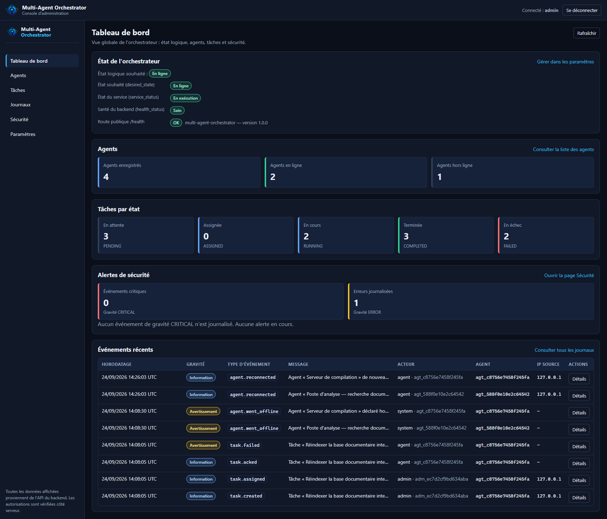
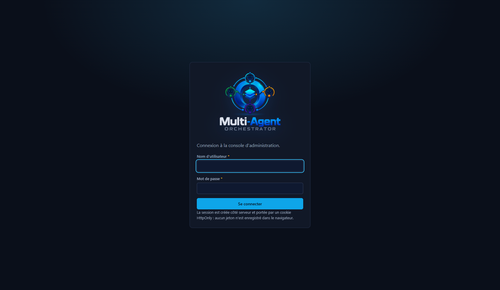
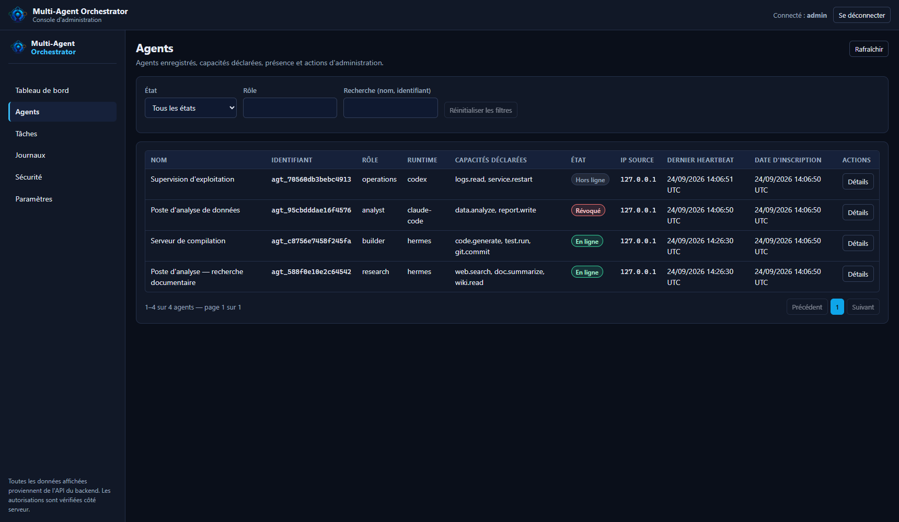
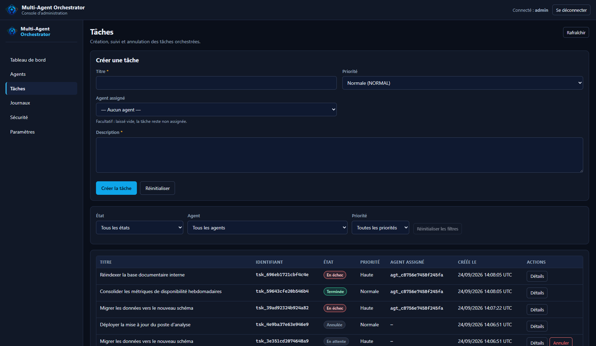
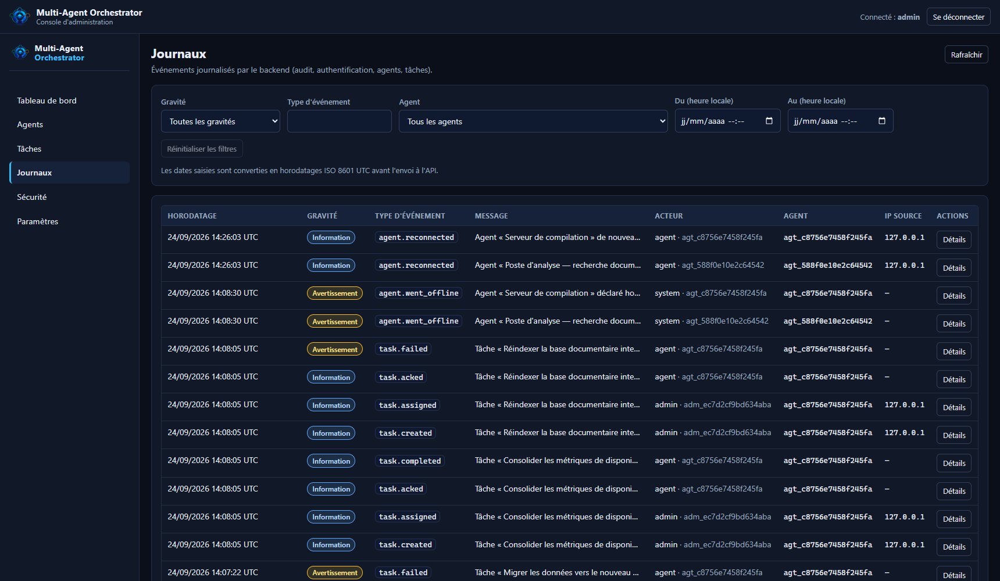
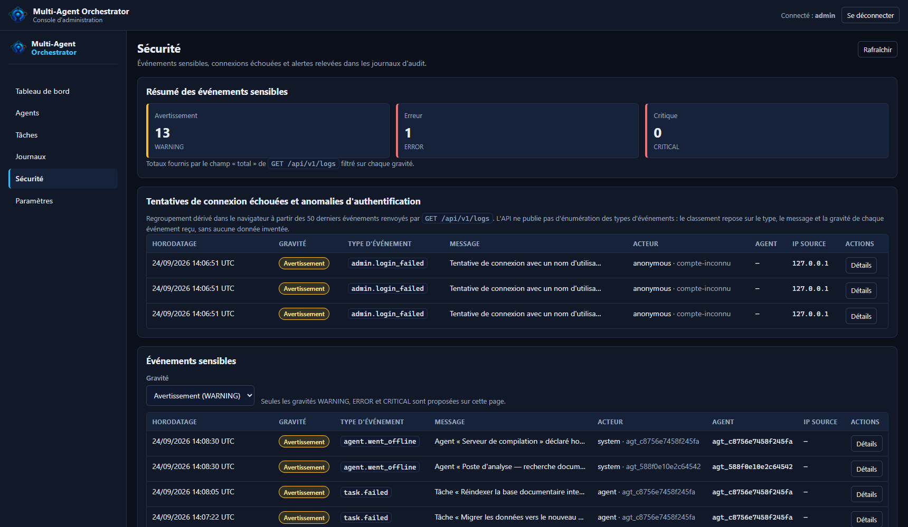
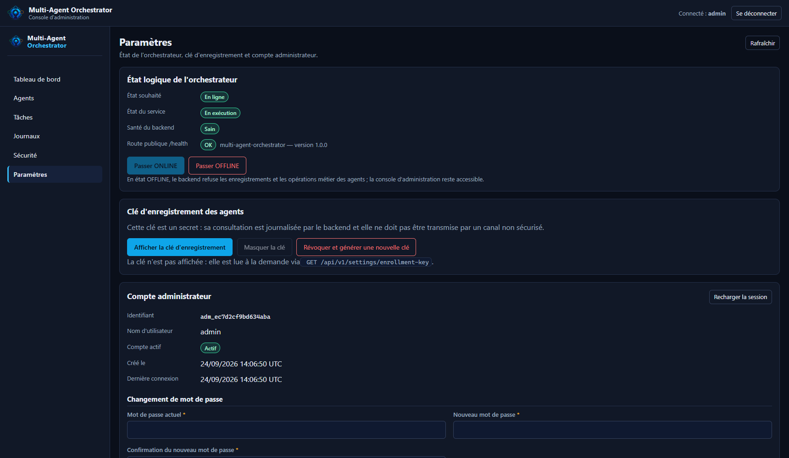

<p align="center">
  
</p>

<h1 align="center">Multi-Agent Orchestrator</h1>

<p align="center">
  Plateforme d'administration centralisée pour parcs d'agents autonomes :
  enregistrement sécurisé, jetons individuels, suivi de présence, cycle de vie des
  tâches et journal d'audit — avec tableau de bord web et installation automatisée
  sur Ubuntu.
</p>

<p align="center">
  <em>FastAPI · SQLite · React 19 · TypeScript · Vite · Nginx · systemd · HTTPS</em>
</p>

---

## Aperçu



Le tableau de bord présente l'état logique de l'orchestrateur (distinct de l'état du
service et de la santé du backend), le parc d'agents, la répartition des tâches par
état et les alertes de sécurité. Toutes les valeurs proviennent de l'API : aucune
donnée n'est simulée.

---

## Sommaire

- [Fonctionnalités](#fonctionnalités)
- [Captures d'écran](#captures-décran)
- [Architecture](#architecture)
- [Pile technique](#pile-technique)
- [Installation](#installation)
- [Recette locale avec Docker](#recette-locale-avec-docker)
- [Prise en main](#prise-en-main)
- [Connecter un agent](#connecter-un-agent)
- [API HTTP](#api-http)
- [Sécurité](#sécurité)
- [Tests](#tests)
- [Exploitation courante](#exploitation-courante)
- [Dépannage](#dépannage)
- [Documentation de référence](#documentation-de-référence)
- [État du projet](#état-du-projet)

---

## Fonctionnalités

### Administration et accès

- **Authentification administrateur** : mots de passe hachés en Argon2id
  (paramètres OWASP), sessions serveur révocables portées par un cookie `HttpOnly`
  (aucun jeton conservé en JavaScript), verrouillage temporaire après échecs répétés.
- **Tableau de bord** : état de l'orchestrateur, parc d'agents, tâches par état,
  alertes de sécurité, tout rafraîchissable à la demande.
- **Protection anti-CSRF** : jeton signé lié à la session, transmis dans un cookie
  lisible et renvoyé dans l'en-tête `X-CSRF-Token` (double soumission). Il est réémis
  à chaque lecture de session, ce qui permet d'agir normalement après un rechargement
  de page.
- **Contrôle d'origine** : une origine étrangère est refusée même si aucune liste
  blanche n'a été déclarée.

### Gestion des agents

- **Enregistrement par clé dédiée** : la clé d'enregistrement est chiffrée au repos
  (AES-GCM) et reste consultable par un administrateur ; sa rotation est explicite.
- **Identité imposée par le serveur** : identifiant interne (`agt_…`), nom rendu
  unique et rôle validé contre une liste blanche (`research`, `builder`, `analyst`,
  `operations`, `general`). Un agent ne choisit ni son identité ni ses droits.
- **Capacités déclarées, jamais accordées** : les capacités sont conservées comme
  déclarations indicatives et ne valident aucune autorisation.
- **Jetons individuels** : un jeton par agent, affiché une seule fois, stocké sous
  forme d'empreinte SHA-256, avec expiration et révocation.
- **Présence** : battements de cœur horodatés par le serveur, détection des agents
  hors ligne, journalisation des reconnexions.
- **Déconnexion logique et révocation** : la déconnexion conserve l'identité et
  l'historique ; la révocation invalide définitivement le jeton et annule les tâches
  en cours.

### Tâches

- **Cycle de vie contrôlé par le backend** :
  `PENDING → ASSIGNED → RUNNING → COMPLETED`, avec `FAILED`, `CANCELLED`, `TIMEOUT`.
  Toute transition non autorisée est refusée avec un code d'erreur explicite.
- **Acquittement idempotent** et cloisonnement strict : un agent ne peut agir que sur
  les tâches qui lui sont attribuées — et toute tentative contraire est journalisée.
- **Résultats conservés** : charge utile JSON bornée et expurgée, conservée après
  redémarrage ; messages d'échec exploitables.

### Observabilité et exploitation

- **Journal d'audit** : événements typés et filtrables, avec acteur, objet, IP
  d'origine et identifiant de requête ; secrets systématiquement expurgés.
- **Événements de sécurité** : connexions refusées, clés invalides, révocation,
  accès inter-agents refusés.
- **Persistance** : SQLite en mode WAL, migrations versionnées appliquées au
  démarrage, état restauré après redémarrage.
- **Déploiement automatisé** : installation complète sur Ubuntu (dépendances,
  Node.js, compilation du frontend, base, compte administrateur, Nginx, systemd,
  TLS), mise à jour avec sauvegarde et retour arrière, désinstallation avec garde-fous.

---

## Captures d'écran

### Connexion



Formulaire de connexion à la console d'administration. Le mot de passe est masqué et
la session n'est jamais conservée dans le navigateur.

### Tableau de bord


Vue globale : état logique (en ligne), état du service (en exécution), santé du
backend, parc d'agents, tâches par état et alertes de sécurité.

### Agents



Parc d'agents avec rôle, exécution (« runtime »), capacités déclarées, état
(`En ligne`, `Hors ligne`, `Révoqué`), IP source, dernier battement de cœur et date
d'inscription. Chaque ligne donne accès au détail et aux actions d'administration
(déconnexion, révocation, suppression).

### Tâches



Liste des tâches avec filtres par état, priorité et agent. Les transitions visibles
(PENDING, RUNNING, COMPLETED, FAILED, CANCELLED) résultent d'exécutions réelles
enregistrées par l'API.

### Journaux



Journal d'audit filtrable : type d'événement, gravité, acteur, objet, IP d'origine et
identifiant de requête. Le détail d'un événement est consultable ligne par ligne.

### Sécurité



Vue sécurité : événements critiques et erreurs, comptes administrateurs, jetons
d'agents, état de la clé d'enregistrement. Les tentatives de connexion refusées et les
révocations y apparaissent immédiatement.

### Paramètres



Paramètres d'exécution, chemin de la base, chemins des journaux, gestion du compte
administrateur et de l'état logique de l'orchestrateur.

---

## Architecture

```
multi-agent-orchestrator/
├── backend/                    API FastAPI + persistance SQLite
│   ├── app/
│   │   ├── api/                routes HTTP (health, auth, agents, tasks, logs, settings)
│   │   ├── core/               configuration, sécurité, authentification, erreurs, état
│   │   ├── models/             modèles SQLAlchemy (agents, tâches, événements, jetons…)
│   │   ├── schemas/            contrats d'entrée/sortie (Pydantic v2)
│   │   ├── services/           logique métier (agents, tâches, jetons, administration…)
│   │   ├── database/           moteur, sessions, migrations versionnées
│   │   ├── monitoring/         présence, santé, alertes
│   │   ├── audit/              journalisation structurée et expurgée
│   │   └── utils/              validation, expurgation, dates UTC
│   ├── scripts/create_admin.py création du premier compte administrateur
│   ├── tests/                  suite de tests (128 tests)
│   ├── smoke_test.py           parcours de bout en bout par HTTP
│   ├── verifier_couture.py     contrôle du contrat frontend ↔ backend
│   ├── Dockerfile              image du backend (recette Docker)
│   └── requirements.txt        dépendances épinglées
├── frontend/                   console React + TypeScript + Vite
│   ├── src/
│   │   ├── pages/              Login, Dashboard, Agents, Tasks, Logs, Security, Settings
│   │   ├── components/         mise en page, composants d'interface, tableaux
│   │   ├── services/           client HTTP (session par cookie, jeton anti-CSRF)
│   │   ├── hooks/  types/  utils/
│   │   └── index.css           thème sombre et identité visuelle
│   ├── Dockerfile              compilation Node puis service par Nginx
│   ├── nginx.container.conf    configuration Nginx du conteneur
│   └── public/                 logo, emblème, icônes de navigateur
├── connector/                  connecteur agent (protocole AGENT_CONNECTION.md)
│   ├── hermes_connector.py     enrôlement, présence, récupération et exécution des tâches
│   └── tests/                  bout en bout + intégration du runtime Hermes
├── deploy/                     installation et exploitation
│   ├── setup.sh                installation complète (14 étapes)
│   ├── update.sh               mise à jour avec sauvegarde et retour arrière
│   ├── uninstall.sh            désinstallation avec préservation des données
│   ├── nginx/  systemd/        gabarits de configuration
│   └── tests/                  tests des scripts, banc Ubuntu, recette Compose
├── docs/                       documents de référence et captures d'écran
├── docker-compose.yml          recette locale (backend + frontend + init)
└── .github/workflows/          intégration continue (Ubuntu, 7 vérifications)
```

Le backend sert lui-même le frontend compilé lorsqu'il est présent (repli SPA), ce qui
permet d'utiliser l'ensemble sur un seul port en développement comme en production
derrière Nginx.

---

## Pile technique

**Backend** — Python 3.11+, FastAPI 0.141.1, SQLAlchemy 2.0.54, Pydantic 2.13.5,
Uvicorn 0.53.0, Argon2id (`argon2-cffi` 25.1.0), limitation de débit (`slowapi`
0.1.10), jetons signés (`itsdangerous` 2.2.0), SQLite (mode WAL).

**Frontend** — React 19, TypeScript (mode strict), Vite. Build : 80 modules,
`index.html` 0,84 ko, CSS 13,3 ko (3,5 ko compressés), JavaScript 332 ko
(101 ko compressés).

**Production** — Ubuntu Server 22.04 ou 24.04, Nginx, systemd (utilisateur système
non privilégié), Certbot / Let's Encrypt. Node.js 20+ n'est requis que pour compiler
le frontend.

---

## Installation

### Prérequis

- Ubuntu Server 22.04 ou 24.04, accès `sudo` ;
- un nom de domaine pointant vers le serveur (ports 80 et 443 accessibles) ;
- une adresse e-mail pour Let's Encrypt si HTTPS est souhaité ;
- une connexion Internet sortante (dépôts Ubuntu, NodeSource, PyPI).

Les paquets manquants sont installés automatiquement : **vous n'avez pas à préparer
Python, Node.js, npm, Nginx, Certbot ni SQLite à l'avance.**

### Installation en une commande

```bash
git clone <url-du-depot> multi-agent-orchestrator
cd multi-agent-orchestrator
sudo bash deploy/setup.sh
```

Le script demande le domaine, l'e-mail Let's Encrypt puis le compte administrateur
(nom d'utilisateur, mot de passe et confirmation — **saisie masquée**).

### Ce que fait l'installateur

1. **Contrôles préalables** : distribution et version d'Ubuntu, privilèges `sudo`,
   connectivité sortante vérifiée en TCP 443 (Ubuntu, NodeSource, PyPI).
2. **Détection de l'existant** : une installation ou une configuration déjà présente
   est repérée puis préservée, jamais écrasée silencieusement.
3. **Dépendances système** : installation des seuls paquets manquants —
   `python3`, `python3-venv`, `python3-pip`, `git`, `curl`, `nginx`,
   `certbot`, `python3-certbot-nginx`, `sqlite3`.
4. **Node.js 20+ et npm** : ajout du dépôt officiel NodeSource lorsque la version
   présente est insuffisante. Le script d'ajout téléchargé est **contrôlé avant
   exécution** (taille et contenu attendus).
5. **Code et environnement Python** : copie de l'arborescence, création du répertoire
   virtuel, installation des dépendances épinglées de `backend/requirements.txt`.
6. **Compilation du frontend (React/Vite)** : `npm ci` puis `npm run build`. Le script
   traite explicitement le cas où npm bloque les scripts d'installation des paquets
   (`esbuild`), cause classique d'échec de compilation sur une machine neuve ; un échec
   de compilation interrompt l'installation avec un message actionnable plutôt que de
   laisser un service incomplet.
7. **Configuration** : écriture de `/etc/multi-agent-orchestrator/production.env`
   (permissions `0600`, hors du dépôt), chemins de données et de journaux, secret
   applicatif généré.
8. **Base et compte administrateur** : migrations appliquées, compte créé avec mot de
   passe haché, clé d'enregistrement initialisée.
9. **Nginx** : site dédié avec préservation stricte des autres sites, `nginx -t`
   contrôlé avant rechargement, retour arrière automatique en cas d'erreur.
10. **TLS** : certificat Let's Encrypt obtenu puis testé, passage en HTTPS après
    vérification ; un échec laisse le service fonctionnel en HTTP.
11. **systemd** : unité durcie (utilisateur dédié, `ProtectSystem`, `NoNewPrivileges`),
    activation puis démarrage.
12. **Vérifications finales** : santé HTTP, page servie, base accessible, service
    actif, journaux sans erreur — avec un récapitulatif final qui n'affiche aucun
    secret.

### Installation sans HTTPS (recette interne)

```bash
sudo bash deploy/setup.sh --domain orchestrateur.interne --no-https --yes
```

### Vérifications après installation

```bash
systemctl status orchestrator          # service actif
sudo nginx -t                          # configuration Nginx valide
curl -s http://127.0.0.1:8000/health   # {"status":"ok", ...}
journalctl -u orchestrator -n 50       # journaux du service
```

Ouvrez ensuite `https://votre-domaine` et connectez-vous avec le compte créé.

### Options utiles

| Option | Effet |
|---|---|
| `--domain <fqdn>` | Domaine public (sinon demandé) |
| `--email <adresse>` | Adresse Let's Encrypt |
| `--admin-user <nom>` | Nom du compte administrateur (défaut : `admin`) |
| `--source-url <url>` / `--branch <nom>` | Dépôt et branche à déployer |
| `--no-https` | HTTP seul, sans certificat |
| `--skip-frontend` | Réutiliser un `frontend/dist` déjà compilé |
| `--reconfigure` | Régénérer `production.env` (sauvegarde horodatée) |
| `--render-only <dir>` | Produire les fichiers Nginx/systemd sans rien installer |
| `--yes` | Accepter les confirmations non destructrices |

Les options se consultent aussi avec `sudo bash deploy/setup.sh --help`.

---

### Recette locale avec Docker

Pour faire tourner l'orchestrateur complet sur un poste de développement, sans
installer Python ni Node, un fichier `docker-compose.yml` est fourni :

```bash
export SECRET_KEY="$(python -c 'import secrets;print(secrets.token_urlsafe(64))')"
export ADMIN_PASSWORD='un-mot-de-passe-solide'      # ≥ 12 caractères, 3 familles
docker compose up -d --build
# interface : http://127.0.0.1:8080      API : http://127.0.0.1:8000
```

Trois services : `backend` (FastAPI dans un conteneur Python), `web` (frontend
compilé servi par Nginx, qui relaie `/api` et `/health` vers le backend) et `init`
(création du compte administrateur dès que le backend est sain). Les données vivent
dans le volume `donnees` ; aucun secret n'est écrit dans le dépôt.

Contrôle de la recette, une fois la pile démarrée :

```bash
python deploy/tests/test-recette-compose.py
```

**Ce fichier ne concerne pas la production** : le déploiement réel reste celui de
`docs/INSTALLATION.md` (Ubuntu Server, venv, Nginx, systemd, HTTPS, utilisateur de
service non privilégié). Les ports sont surchargeables (`BACKEND_PORT`, `WEB_PORT`)
et la recette est également vérifiée par l'intégration continue.

## Prise en main

1. **Se connecter** sur `https://votre-domaine` avec le compte administrateur créé
   pendant l'installation. Le compte affiché en haut à droite permet de changer le mot
   de passe (les autres sessions sont alors révoquées).
2. **Enregistrer un premier agent** : depuis *Paramètres → Clé d'enregistrement*,
   relevez la clé (ou faites-la tourner), puis utilisez le connecteur décrit ci-dessous.
3. **Créer une tâche** : *Tâches → Nouvelle tâche*, avec un titre, une priorité et,
   éventuellement, un agent destinataire. L'agent l'acquitte, la passe en exécution,
   puis dépose son résultat.
4. **Suivre l'activité** : *Journaux* pour l'audit complet, *Sécurité* pour les
   événements sensibles, *Tableau de bord* pour la vue d'ensemble.

---

## Connecter un agent

Le connecteur implémente `docs/AGENT_CONNECTION.md` avec la seule bibliothèque standard
de Python : identité locale persistante, enrôlement, présence périodique, récupération
des tâches, acquittement, dépôt du résultat et reprise après coupure.

```bash
# 1. enrôlement (une seule fois) : la clé vient des Paramètres du tableau de bord
python connector/hermes_connector.py enroll \
  --url https://votre-domaine \
  --enrollment-key <cle-d-enregistrement> \
  --name "Poste d'analyse 01" \
  --role analyst \
  --runtime hermes

# 2a. exécution par Hermes : la CLI du runtime traite l'énoncé de la tâche
python connector/hermes_connector.py run --url https://votre-domaine --hermes

# 2b. ou avec un exécuteur local explicite de votre choix
python connector/hermes_connector.py run \
  --url https://votre-domaine \
  --commande 'mon-executeur --tache "$ORCHESTRATOR_TASK_ID"'

# état local, puis déconnexion logique
python connector/hermes_connector.py status
python connector/hermes_connector.py disconnect
```

Le connecteur **n'exécute rien par défaut** : sans exécuteur déclaré (`--hermes` ou
`--commande`), les tâches
reçues sont marquées en échec avec un motif clair, afin qu'aucune instruction reçue du
serveur ne soit exécutée à l'insu de l'exploitant.

---

## API HTTP

31 chemins sont publiés (dont les 28 documentés dans `docs/API.md`), tous préfixés par
`/api/v1` sauf la sonde publique `/health`. Aperçu :

| Domaine | Routes principales |
|---|---|
| Santé | `GET /health` |
| Authentification | `POST /auth/login`, `GET /auth/me`, `POST /auth/logout`, `POST /auth/change-password` |
| Agents | `GET /agents`, `GET /agents/{id}`, `DELETE /agents/{id}`, `POST /agents/{id}/disconnect`, `POST /agents/{id}/revoke` |
| Protocole agent | `POST /agents/enroll`, `GET /agents/me`, `POST /agents/heartbeat`, `GET /agents/tasks`, `POST /agents/tasks/{id}/ack`, `POST /agents/tasks/{id}/status`, `POST /agents/tasks/{id}/result` |
| Tâches | `GET/POST /tasks`, `GET /tasks/{id}`, `POST /tasks/{id}/cancel`, `GET /tasks/state-machine` |
| Journaux | `GET /logs`, `GET /logs/{id}`, `GET /logs/reference`, `GET /logs/agent/{id}/historique` |
| Paramètres | `GET /settings/service`, `GET /settings/security`, `GET /settings/orchestrator`, `POST /settings/orchestrator/state`, `GET /settings/parameters`, `GET/POST /settings/enrollment-key` |

Exemple :

```bash
# enrôlement d'un agent avec la clé d'enregistrement
curl -X POST https://votre-domaine/api/v1/agents/enroll \
  -H "Authorization: Bearer <cle-d-enregistrement>" \
  -H "Content-Type: application/json" \
  -d '{"runtime":"hermes","client_instance_id":"poste-01",
       "requested_name":"Poste d analyse 01","declared_role":"analyst",
       "capabilities":["data.analyze","report.write"]}'
```

La documentation interactive (`/docs`) est **protégée par l'authentification
administrateur** et peut être désactivée par configuration.

---

## Sécurité

- Mots de passe : Argon2id, paramètres OWASP.
- Jetons d'agent : 256 bits, jamais réaffichés, empreinte SHA-256 en base.
- Clé d'enregistrement : chiffrée au repos (AES-GCM, clé dérivée par HKDF).
- Sessions : cookie `HttpOnly` + `SameSite`, expiration absolue **et** par inactivité,
  révocation côté serveur ; aucun jeton en `localStorage`.
- Anti-CSRF : jeton signé lié à la session (double soumission) ; contrôle d'origine.
- Limitation de débit sur la connexion, l'enregistrement et les routes d'agent.
- Expurgation systématique des secrets dans les journaux, les événements et les
  réponses d'erreur (vérifiée par les tests).
- En-têtes de sécurité (CSP, `nosniff`, `DENY`, `Referrer-Policy`), `Cache-Control`
  sur les réponses sensibles.
- Vérification TLS jamais désactivée côté client (contrôlée par analyse du code).
- Déploiement : secrets hors du dépôt (`/etc/…`, `0600`), utilisateur système dédié,
  unité systemd durcie, `X-Forwarded-*` maîtrisés derrière Nginx.
- Aucun secret dans Git : `.gitignore` et test dédié.

Détails et modèle de menaces : [`docs/SECURITY.md`](docs/SECURITY.md).

---

## Tests

```bash
cd backend
python -m pytest tests/            # 128 tests
```

**128 tests, 0 échec** — santé et documentation, authentification et sessions, agents,
tâches, état de l'orchestrateur, journalisation, sécurité, persistance et intégration,
migrations.

| Vérification | Commande | Résultat |
|---|---|---|
| Tests backend | `pytest tests/` | 128 tests, 0 échec |
| Types du frontend | `npx tsc --noEmit` | 0 erreur |
| Compilation du frontend | `npm run build` | 80 modules, build réussi |
| Contrat frontend ↔ backend | `python verifier_couture.py` | tous les contrôles au vert |
| Parcours HTTP complet | `python smoke_test.py` | chaîne complète validée |
| Connecteur | `bash connector/tests/test_bout_en_bout.sh` | enrôlement → tâche terminée → état vérifié |
| Intégration Hermes | `python connector/tests/test_integration_hermes.py` | tâche créée, **exécutée par Hermes**, résultat enregistré |
| Recette Docker | `python deploy/tests/test-recette-compose.py` | pile Compose montée : frontend servi, API relayée, session et anti-CSRF |
| Scripts de déploiement | `bash deploy/tests/*.sh` | préservation et retour arrière validés |

---

## Exploitation courante

```bash
# mettre à jour (sauvegarde de la base, empreinte, reconstruction du frontend)
sudo bash deploy/update.sh

# lister les sauvegardes puis revenir en arrière si nécessaire
sudo bash deploy/update.sh --list-backups
sudo bash deploy/update.sh --rollback

# suivre le service
systemctl status orchestrator
journalctl -u orchestrator -f
```

Emplacements par défaut : code dans `/opt/multi-agent-orchestrator`, configuration dans
`/etc/multi-agent-orchestrator`, données et journaux sous `/var/lib` et `/var/log`.

**Désinstallation** — la suppression des données n'est jamais implicite :

```bash
sudo bash deploy/uninstall.sh                      # retire le service et le site Nginx
sudo bash deploy/uninstall.sh --dry-run            # montre ce qui serait fait
sudo bash deploy/uninstall.sh --purge-config --purge-data --confirm-data-loss
```

---

## Dépannage

| Symptôme | Cause probable et action |
|---|---|
| Échec de la compilation du frontend | Node.js absent ou trop ancien, ou scripts npm bloqués : relancez `sudo bash deploy/setup.sh` (il installe Node.js 20+ via NodeSource) ; vérifiez `node --version`. |
| `502 Bad Gateway` | Service arrêté ou en erreur : `systemctl status orchestrator` puis `journalctl -u orchestrator -n 100`. |
| Le certificat n'a pas été obtenu | Le domaine ne pointe pas encore vers le serveur, ou le port 80 est fermé. Corrigez le DNS puis `sudo certbot --nginx -d votre-domaine`. |
| `Python venv indisponible` | `python3-venv` manquant : `sudo apt-get install python3-venv`, puis relancez l'installation. |
| Aucune connectivité sortante | Le script l'annonce explicitement : autorisez les accès sortants vers les dépôts Ubuntu, `deb.nodesource.com` et PyPI. |
| Connexion refusée après plusieurs essais | Verrouillage temporaire du compte : attendez la fin du délai ou reprenez la main côté base avec `backend/scripts/create_admin.py`. |
| Une action du tableau de bord renvoie 403 | Jeton anti-CSRF absent ou expiré : rechargez la page (il est réémis automatiquement à la lecture de session). |

---

## Documentation de référence

Les cinq documents qui font foi pour ce projet sont conservés tels quels :

- [`docs/ARCHITECTURE.md`](docs/ARCHITECTURE.md) — architecture, modules, modèle de données ;
- [`docs/API.md`](docs/API.md) — contrats HTTP, formats d'erreur, pagination ;
- [`docs/SECURITY.md`](docs/SECURITY.md) — modèle de menaces et règles de sécurité ;
- [`docs/INSTALLATION.md`](docs/INSTALLATION.md) — procédure d'installation officielle ;
- [`docs/AGENT_CONNECTION.md`](docs/AGENT_CONNECTION.md) — protocole agent.

---

## État du projet

**Développement local terminé et vérifié** : 128 tests backend au vert, types et
compilation du frontend vérifiés, contrat frontend ↔ backend contrôlé contre l'API
réelle, parcours navigateur complet sur les sept pages (aucune erreur console ni
requête en échec), recette Docker complète vérifiée (13/13 : frontend compilé servi
par Nginx, API relayée, session et anti-CSRF), connecteur validé de bout en bout
contre un vrai serveur, **tâche réellement exécutée par le runtime Hermes et résultat
enregistré**, scripts de déploiement couverts par leurs propres tests.

**Reste à valider en environnement réel** : exécution de `deploy/setup.sh` sur une
machine Ubuntu de recette (dont `nginx -t` et `systemd-analyze verify` en conditions
réelles) et obtention effective d'un certificat Let's Encrypt sur un domaine public.

---

<p align="center">
  
</p>
